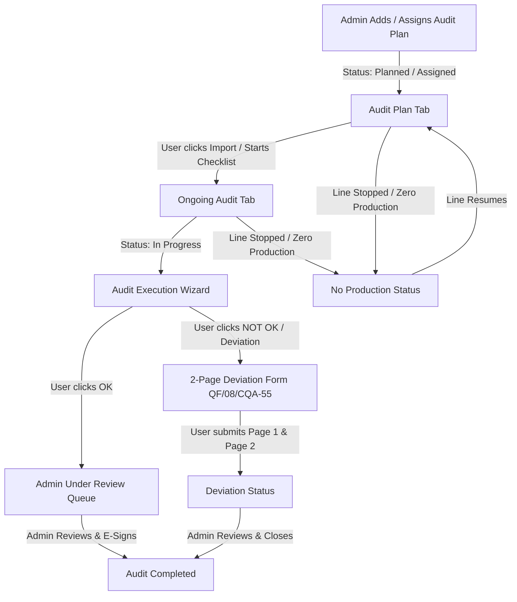

# Sakthi Auto Components — Quality Audit & Job Tracker Platform
## Complete Technical Architecture, System Workflows, and Developer Documentation

---

## 1. Executive Summary & System Overview

The **Sakthi Auto Components Job Tracker & Audit Management System** is an enterprise-grade manufacturing quality assurance and audit execution platform designed specifically for automotive component plants (machining lines, foundry, rough casting, and assembly operations).

The system digitizes the entire end-to-end quality inspection lifecycle:
1. **Annual & Monthly Audit Scheduling & Assignment** across Product, Revalidation, and Dock Audits.
2. **Audit Execution & Inspection Forms** with live Excel checklist imports, photo evidence attachment, and authenticated inspector e-signatures.
3. **Automated Status Progression & Admin Review Queue** with digital approval workflows.
4. **Industrial 2-Page Non-Conformance & Deviation Processing** complying with standard automotive formats (**Page 1 Format: `QF/08/CQA-55`** and **Page 2 Format: Root Cause Analysis, CAPA & Quarantine Segregation**).
5. **Plant-Level Roster & Role-Based Access Control** differentiating Quality Operations Leads (Admins) and Plant Quality Inspectors (Employees).

---

## 2. Technology Stack & Framework Architecture

| Layer | Technology | Description |
|---|---|---|
| **Frontend Framework** | **React 19** + **TypeScript 5.8** | Component-driven UI with strict type safety. |
| **Routing** | **TanStack Router (v1.170)** | Type-safe file-based client routing with search param validation. |
| **Data Fetching & Cache** | **TanStack Query (v5.101)** | Server state management, optimistic updates, and cache invalidation. |
| **Backend & Database** | **Supabase (PostgreSQL)** | Remote relational database for assignments, deviations, profiles, and audit records. |
| **Offline / Local Sync** | **HTML5 Web Storage + Custom Events** | Local persistence (`localStorage`) with window event dispatching for real-time reactivity. |
| **Styling & Design System** | **Tailwind CSS v4** + **tw-animate-css** | Industrial high-contrast UI tailored for factory floors and desktop browsers. |
| **UI Components** | **Radix UI Primitives** | Accessible dialogs, tooltips, dropdowns, tabs, and modals. |
| **Spreadsheet Engine** | **SheetJS (`xlsx` v0.18.5)** | Bidirectional Excel file parsing (`.xlsx`, `.xls`, `.csv`), checklist export, and templating. |
| **Icons & Typography** | **Lucide React** (`lucide-react`) | Industrial icon set for clear operational visual cues. |
| **Date & Time Utilities** | **Date-fns (v4.1)** | Automotive timestamping, live clocks, and ISO date parsing. |
| **Notifications** | **Sonner** | Non-blocking toast feedback for operational actions. |

---

## 3. Directory Structure & File Map

```text
sakthi-spark-flow/
├── public/
│   ├── favicon.ico
│   └── Checklist_Template.xlsx        # Master blank checklist template for offline Excel filling
├── src/
│   ├── components/
│   │   ├── admin/
│   │   │   ├── ElectronicSignatureRegistry.tsx  # Admin e-signature verification matrix
│   │   │   ├── EmployeeActivityLogsGrid.tsx     # Operator activity audit trails
│   │   │   ├── JobReviewTab.tsx                 # Admin review & final e-sign dashboard
│   │   │   └── SubmittedAuditsRegister.tsx      # Register of submitted inspections
│   │   ├── app/
│   │   │   ├── AppShell.tsx                     # Main layout shell with live clock & dynamic nav
│   │   │   └── StatusBadge.tsx                  # Standardized color-coded status badges
│   │   ├── brand/
│   │   │   └── SakthiLogo.tsx                   # Sakthi Auto brand trident and typography
│   │   ├── excel/
│   │   │   ├── ExcelChecklistGrid.tsx           # Full interactive Excel checklist grid editor
│   │   │   └── ExcelTaskGrid.tsx                # Master audit task matrix grid
│   │   ├── plans/
│   │   │   └── PlanModal.tsx                    # Annual plan creation modal
│   │   └── ui/                                  # Reusable Radix UI & design system primitives
│   ├── hooks/
│   │   └── useAuth.tsx                          # Authentication state, profile info, and admin detection
│   ├── integrations/
│   │   └── supabase/
│   │       ├── client.ts                        # Supabase client singleton
│   │       └── types.ts                         # Auto-generated database table schemas
│   ├── lib/
│   │   ├── audit.ts                             # Master audit types, categories, default tasks, deduplication
│   │   ├── electronicSignatures.ts              # Roster signatures & employee verification
│   │   ├── excelUri.ts                          # MS Office URI scheme deep linking (`ms-excel:ofe|u|...`)
│   │   ├── submittedAudits.ts                   # Local & remote storage helpers for submitted audits
│   │   └── utils.ts                             # Tailwind class merger (cn helper)
│   ├── routes/
│   │   ├── __root.tsx                           # TanStack Router root provider & error boundary
│   │   ├── index.tsx                            # Landing / Login route
│   │   └── _authenticated/
│   │       ├── route.tsx                        # Auth protection layout wrapper
│   │       ├── dashboard.tsx                    # 3-Tier Touch Dashboard (Master Audit Cockpit)
│   │       ├── audit.$auditId.tsx               # 3-Step Wizard Audit Inspection Execution Form
│   │       ├── deviations.tsx                   # Industrial 2-Page Deviation Report (QF/08/CQA-55 & CAPA)
│   │       ├── audits.tsx                       # Full Plant Audit Register with filtering & exports
│   │       ├── assignments.tsx                  # Monthly Excel Assignment Matrix
│   │       ├── plans.tsx                        # Annual Plan Creator
│   │       └── review.tsx                       # Review & E-Sign Queue for Admin
│   ├── routeTree.gen.ts                         # Auto-generated TanStack route tree
│   └── styles.css                               # Global CSS & Tailwind theme tokens
├── package.json
├── tsconfig.json
├── vite.config.ts
└── PROJECT_DOCUMENTATION.md                     # This technical reference document
```

---

## 4. Official Plant Roster & Authorization Model

The system enforces an explicit employee roster mapped to plant departments and permissions:

```typescript
export const OFFICIAL_ROSTER: Record<string, { 
  name: string; 
  department: string; 
  designation: string; 
  role: "admin" | "employee" 
}> = {
  "690867": { name: "KARTHIKEYAN C", role: "admin", department: "Quality Assurance", designation: "Quality Operations Lead" },
  "688079": { name: "SILAMBARASAN S", role: "employee", department: "Machining Line 1", designation: "Senior Quality Engineer" },
  "663875": { name: "VENKADESH D", role: "employee", department: "Machine Shop 2", designation: "Quality Inspector" },
  "710250": { name: "MOUNIKASRI A", role: "employee", department: "Quality Lab", designation: "Metrology Specialist" },
  "666468": { name: "KAVIN KUMAR K", role: "employee", department: "Assembly & Dock", designation: "Process Audit Lead" },
  "665773": { name: "KARTHEEBAN K", role: "employee", department: "Value Added Engg", designation: "Revalidation Specialist" },
  "665965": { name: "DINESHKUMAR A B", role: "employee", department: "Tool Room", designation: "Maintenance Lead" },
  "708818": { name: "SELVAKUMAR J", role: "employee", department: "EHS & Safety", designation: "Compliance Auditor" },
  "667685": { name: "GEETHA S", role: "employee", department: "Plant Management", designation: "Plant Head Quality" },
};
```

### Access Levels:
- **Admin (`KARTHIKEYAN C` - Emp #690867)**:
  - Can create and reschedule yearly audit plans.
  - Can import bulk audit lists and checklists via Excel.
  - Can view all plant tasks across all 6 status cards.
  - Has authority to approve and e-sign audits in **Under Review**.
  - Can change status between Completed Audit and Deviation.
- **Regular Inspector / Employee (`SILAMBARASAN S`, etc.)**:
  - In **Audit Plan**: Sees assigned scheduled audits with options to download templates, move to No Production, or click **Import** to start.
  - In **Ongoing Audit**: Displays **only** audits imported/started by that specific employee.
  - In **Deviation**: Deviation tab and notification icons appear only while actively completing a 2-page deviation form.

---

## 5. Core Operational Workflows & State Machine



### 5.1 Three-Tier Dashboard Structure
The master dashboard (`/dashboard`) operates on a 3-level filtering architecture:

1. **Level 1: Touch Audit Category Selection**
   - **Product Audit**: Casting, dimensional & metallurgical quality verification (MSIL Knuckle, etc.).
   - **Revalidation Audit**: Bi-annual product layout & safety revalidation (Bolero, MPV Knuckles).
   - **Dock Audit**: Dispatch packaging, VCI cover, cleanliness & dock inspection (Stellantis Pivot Suspension).

2. **Level 2: Six Real-Time Status Cards**
   1. **Audit Plan**: Scheduled annual and monthly plans (`Planned`, `Assigned`, `Pending`).
   2. **Ongoing Audit**: Audits actively imported and in-progress by the user (`In Progress`, `Ongoing`). *Excludes un-imported assigned tasks.*
   3. **Under Review**: Audits submitted by inspectors awaiting Admin review and signature (`Submitted`, `Under Review`).
   4. **Audit Completed**: Signed, approved, and closed audits (`Completed`, `Approved`).
   5. **Deviation**: Non-conforming lots with active CAPA workflows (`Deviation`).
   6. **No Production**: Audits paused due to zero plant output or line stoppage (`No Production`).

3. **Level 3: Plan Sub-Views**
   - **One Year Plan**: Complete 12-month calendar matrix.
   - **As-on-Month Plan**: Target month dropdown filter (January to December).
   - **Current Month Plan**: Auto-filtered to the current active calendar month.

---

## 6. Detailed Inspection & Deviation Workflows

### 6.1 Audit Execution Wizard (`/audit/$auditId`)
A 3-step structured inspection wizard:
- **Step 1: Checkpoints Table**:
  - Quality characteristics: Hardness (BHN/HRB), Spheroidization %, Pearlite %, Tensile Strength (MPa), Yield Strength, Elongation, Receiving Rough Casting Appearance, and Black Dip Painting.
  - Excel file import for custom checkpoint rows.
  - Individual Pass / Fail toggling.
- **Step 2: Notes & Photo Evidence**:
  - Inspector observation notes.
  - Upload up to 3 high-resolution component inspection photos with preview and deletion.
- **Step 3: Authenticated E-Signature & Decision**:
  - Authentication against employee ID to automatically attach registered digital signature.
  - **Decision Options**:
    - **OK**: Advances the audit to `Under Review` status, moves it directly to the Admin's review queue, and clears it from the user's Ongoing list.
    - **NOT OK**: Auto-prefills audit information and immediately opens the 2-Page Deviation Report.

---

### 6.2 Industrial 2-Page Deviation Report (`/deviations`)

The Deviations module strictly reproduces the physical factory forms:

#### Page 1: Deviation Report Format (`QF/08/CQA-55`)
- **Document Metadata**: Standard code `QF/08/CQA-55`, Rev Date `29.12.2016`.
- **Header Box**: Clean `SAKTHI AUTO` trident text, `DEVIATION REPORT` title, and Date.
- **Routing**: `FROM` department (Quality Assurance) & `TO` department (Production / Machine Shop).
- **Part Information**: Part Name, Part Number, and Stage (`INPROCESS` / `FINISHED` / `DEVELOPMENT`).
- **6-Sample Observation Matrix**:
  - Columns: `SL. NO.`, `SPECIFICATION`, `OBSERVATION (1, 2, 3, 4, 5, 6)`, `REMARKS / NOTE`.
  - Up to 8 ruled physical lines.
- **CC Routing**: Plant Head, QA Manager, Production Incharge with ruled lines.
- **Sign-Off Box**: `INSPECTED BY` & `APPROVED BY` signature areas.

#### Page 2: Root Cause Analysis, CAPA & Quarantine Details
- **CAPA Table**:
  - Columns: `Date`, `Part Name`, `Part No.`, `Non Conformance Details`, `Root Cause`, `Corrective Action`.
- **Quarantine Section**:
  - **Mathematical Validation Rule**:
    $$\text{Segregated Quantity} = \text{OK Quantity} + \text{NOT OK Quantity}$$
    The UI dynamically validates the sum in real-time, blocking submission if numbers do not balance.
  - **Signatures**:
    - `SEGGREGATED BY` (Inspector signature).
    - `APPROVED BY` (Admin signature).

---

## 7. Data Models & Local Storage Schema

### 7.1 Primary Types (`Assignment` & `DeviationItem`)

```typescript
export type Assignment = {
  id: string;
  sl_no?: number | string;
  audit_code: string;
  title: string;
  audit_type: "Product" | "Process" | "Revalidation" | "Dock Audit" | string;
  area: string;
  month: number;
  year: number;
  due_date: string;
  status: "Planned" | "Assigned" | "In Progress" | "Submitted" | "Under Review" | "Completed" | "Deviation" | "No Production" | "Overdue";
  auditor_name?: string;
  assigned_to_employee_number?: string;
  department?: string;
  progress_pct?: number;
  planned_date?: string;
  start_date_time?: string;
  completion_date?: string;
  final_result?: string;
  document_url?: string;
  attached_file_name?: string;
  attached_file_url?: string;
  is_imported?: boolean;
  imported_by?: string;
};

export type DeviationItem = {
  id: string;
  audit_id?: string;
  dev_code: string;
  description: string;
  observed_condition: string;
  location_operation: string;
  employee_number: string;
  severity: "High" | "Medium" | "Low";
  status: "draft" | "page1_submitted" | "page1_approved" | "under_review" | "closed" | "rejected";
  created_at: string;
  
  // Page 1 (QF/08/CQA-55)
  report_date: string;
  from_dept: string;
  to_dept: string;
  part_name: string;
  part_number: string;
  stage: "INPROCESS" | "FINISHED" | "DEVELOPMENT";
  observations: DeviationObservationItem[];
  cc: string;
  doc_code: string;
  doc_date: string;
  inspected_by: string;
  inspected_by_signature?: string;
  approved_by: string;
  approved_by_signature?: string;

  // Page 2 (CAPA & Quarantine)
  capa_items: DeviationCapaItem[];
  quarantine_segregated_qty: string;
  quarantine_ok_qty: string;
  quarantine_not_ok_qty: string;
  quarantine_segregated_by: string;
  quarantine_segregated_by_signature?: string;
  quarantine_approved_by: string;
  quarantine_approved_by_signature?: string;
};
```

### 7.2 Web Storage Keys

| Key | Purpose |
|---|---|
| `sakthi_excel_tasks_v8` | Master task register list (persists imported & created audits). |
| `sakthi_deviations` | All plant deviation records and 2-page reports. |
| `sakthi_submitted_audits_v2` | Submissions register awaiting review. |
| `sakthi_active_deviation_in_progress` | Flag indicating active deviation completion (triggers nav tab visibility). |
| `sakthi_deviation_prefill` | Pre-fill payload transferred from audit inspection to deviation form. |
| `sakthi_audit_draft_{auditId}` | Checkpoint and notes drafts for offline recovery. |

---

## 8. Excel & Offline Protocol Integration

### 8.1 Microsoft Excel Desktop Deep Linking
The platform supports direct launching of local Microsoft Excel applications using Office URI schemes:
```typescript
export function createExcelUri(fileUrl: string, mode: "view" | "edit" = "view"): string {
  const protocol = mode === "edit" ? "ms-excel:ofe|u|" : "ms-excel:ofv|u|";
  return `${protocol}${encodeURI(fileUrl)}`;
}
```

### 8.2 Excel File Import & Deduplication
When users or admins import `.xlsx` / `.csv` spreadsheets, `mergeAndDeduplicateTasks()` runs automatically to ensure no identical audit records or part numbers are duplicated across multiple uploads.

---

## 9. Developer Setup & Onboarding Guide

### Prerequisites
- **Node.js**: v18.0.0 or higher (v20+ recommended).
- **Package Manager**: `npm` or `bun`.
- **Git**: For version control.

### Installation & Local Run

1. **Clone the repository:**
   ```bash
   git clone https://github.com/lathikaJ/Sakthi_Auto_COmponents_Job_Tracker.git
   cd sakthi-spark-flow
   ```

2. **Install dependencies:**
   ```bash
   npm install
   ```

3. **Start the development server:**
   ```bash
   npm run dev
   ```
   The local application will launch on `http://localhost:5173`.

4. **Verify TypeScript type checking:**
   ```bash
   npx tsc --noEmit
   ```

5. **Build for production:**
   ```bash
   npm run build
   ```

---

## 10. Collaboration & Contribution Guidelines

- **Lovable Sync Rule**: Never force push (`git push --force`) or rebase published history on `main`, as the project is synchronized with Lovable editor history.
- **Form Integrity**: Keep deviation form formats strictly aligned with industrial standards (`QF/08/CQA-55` and standard CAPA/Quarantine layouts) without arbitrary styling changes.
- **Role Awareness**: Test all UI views as both **Admin** (`KARTHIKEYAN C - 690867`) and **Employee** (`SILAMBARASAN S - 688079`).

---

*Documentation compiled and maintained for Sakthi Auto Components Ltd — Quality Assurance & Operations Team.*
